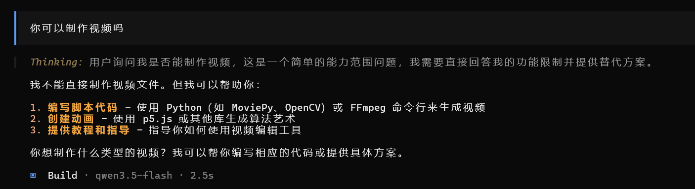

# Skill 使用指南


## 1. 什么是 Skill


Skill（技能）是一种让 AI 助手能够执行特定任务的扩展功能。通过 Skill，AI 可以：

- **执行复杂操作**：如触发构建、生成视频、操作数据库等
- **调用外部工具**：与 Jenkins、Git、API 等服务交互
- **执行脚本命令**：运行自定义的 Python、Bash 等脚本
- **管理状态**：在对话中保持上下文和状态信息

### Skill 的核心特点

| 特点 | 说明 |
|------|------|
| **模块化** | 每个 Skill 专注于一个特定功能 |
| **可组合** | 多个 Skill 可以协同工作 |
| **可扩展** | 用户可以自定义创建自己的 Skill |
| **易集成** | 通过配置文件和脚本快速集成到 AI 系统 |


---

## 2. 演示工具 Opencode 和 Trae

### Opencode

https://opencode.ai/docs/zh-cn/skills/

### Trae

https://docs.trae.cn/ide/skills


### 安装skills
1.  anthropic官方仓库：`https://github.com/anthropics/skills`
2.  Skills社群网站：`https://skillsmp.com/zh`
3.  优秀开源集合：`https://github.com/ComposioHQ/awesome-claude-skills`
4.  视频制作skill：`https://github.com/remotion-dev/skills`
5.  youtube视频剪辑skill：`https://github.com/op7418/Youtube-clipper-skill`
6.  大师帮你创建skill的skill：`https://github.com/GBSOSS/skill-from-masters`
7.  notebookLM skill：`https://github.com/PleasePrompto/notebooklm-skill`
8.  markdown发布到X skill：`https://github.com/wshuyi/x-article-publisher-skill`
9.  AI 视频产品 Vidu Skills：`https://www.vidu.cn/`
---

## 3.  Skill 使用示例

### 未安装 Skill 的情况

当 AI 助手没有安装相关 Skill 时，无法执行特定任务。

**示例对话：**

```
用户：你可以制作视频吗？
```



### 使用 Skill 制作视频

**场景**：使用 Remotion Skill 制作一个演示冒泡排序原理的视频

**用户输入：**
```
/remotion-best-practices 制作一个视频，用来介绍冒泡排序的原理，视频长度为30s左右

```

## 6. 使用 Skill 制作 Skill


### 实战示例：Jenkins Build Trigger Skill

我们以当前目录下的 `jenkins-build-trigger` Skill 为例进行介绍。

**Skill 位置**：`.opencode/skills/jenkins-build-trigger/`

**详细文档**：[查看 SKILL.md](./jenkins/.opencode/skills/jenkins-build-trigger/SKILL.md)

